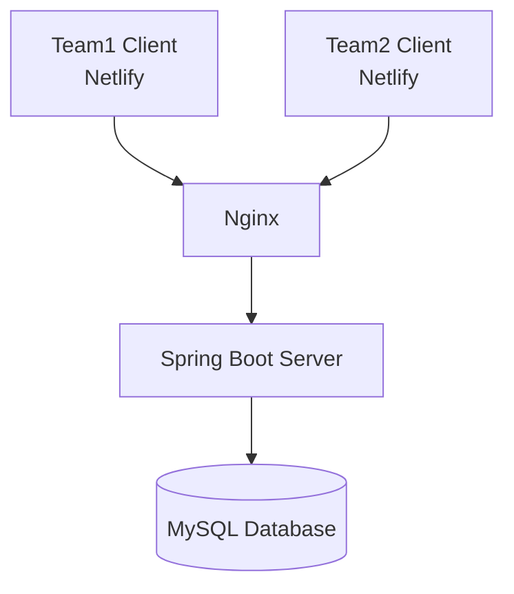

# Walk or Run 🏃‍♂️
## 프로젝트 소개
삼성 헬스 데이터 내보내기를 활용한 러닝 데이터 대시보드 및 커뮤니티 기능을 제공하는 백엔드 REST API 서버입니다.

## 팀원
<table>
  <tr>
    <td align="center">
      <br />
      <b>clapsheep</b><br />
      <a href="https://github.com/clapsheep">
        
      </a>
    </td>
    <td align="center">
      <br />
      <b>rpeowiqu</b><br />
      <a href="https://github.com/rpeowiqu">
        
      </a>
    </td>
    <td align="center">
      <br />
      <b>zyu22</b><br />
      <a href="https://github.com/zyu22">
        
      </a>
    </td>
    <td align="center">
      <br />
      <b>yujeong789</b><br />
      <a href="https://github.com/yujeong789">
        
      </a>
    </td>
  </tr>
</table>

## 기술 스택
| Category | Technologies |
|----------|-------------|
| Backend |  |
| Database |  <br>  |
| DevOps |  <br>  <br>  <br>  |

## 데이터베이스 스키마
### 사용자 관련 테이블
| 테이블명 | 설명 | 주요 컬럼 |
|:---------|:-----|:----------|
| Users | 사용자 정보 | user_id(PK), user_email, user_name, user_nickname |
| Password_Question | 비밀번호 찾기 질문 | question_id(PK), question_description |
| Password_Answers | 비밀번호 답변 | password_answer_id(PK), user_id(FK), question_id(FK) |
| Tokens | 인증 토큰 | token_id(PK), user_id(FK), access_token, refresh_token |

### 챌린지 관련 테이블
| 테이블명 | 설명 | 주요 컬럼 |
|:---------|:-----|:----------|
| Challenges | 챌린지 정보 | challenge_id(PK), challenge_title, challenge_description |
| Challenge_Categories | 챌린지 카테고리 | challenge_category_code(PK), challenge_category_name |
| Challenge_Participants | 챌린지 참여자 | participant_id(PK), challenge_id(FK), user_id(FK) |
| Comments | 챌린지 댓글 | comment_id(PK), challenge_id(FK), comment_content |

### 운동 데이터 테이블
| 테이블명 | 설명 | 주요 컬럼 |
|:---------|:-----|:----------|
| Time | 운동 시간 정보 | time_id(PK), user_id(FK), start_time, end_time |
| Calorie | 소모 칼로리 | calorie_id(PK), time_id(FK), total_calorie |
| HeartRate | 심박수 정보 | heart_rate_id(PK), time_id(FK), max/min/mean_heart_rate |
| Distance | 이동 거리 | distance_id(PK), time_id(FK), distance |
| Steps | 걸음 수 | steps_id(PK), time_id(FK), step_count |
| Speed | 속도 정보 | speed_id(PK), time_id(FK), mean_speed, max_speed |

## API 문서 📚
REST API 명세서는 Swagger UI를 통해 제공됩니다: [API 문서](https://walk-or-run.com/swagger-ui/index.html#/)

## 클라이언트 개발 🖥️
백엔드 개발자들이 2개의 팀으로 나뉘어 각각 다른 프론트엔드를 개발했습니다.

### Team 1
- **개발자**: clapsheep, rpeowiqu
- **배포 주소**: [WOR Dashboard](https://wor-dashboard.netlify.app/dashboard)
- **Repository**: [walk-or-run-server](https://github.com/clapsheep/walk-or-run-server)

### Team 2
- **개발자**: zyu22, yujeong789
- **배포 주소**: [Walk or Run](https://walkorrun-uu.netlify.app)
- **Repository**: [walk-or-run-client](https://github.com/zyu22/walk-or-run-client)

## 프로젝트 구조 🏗
```bash
src
├── main
│   ├── java
│   │   └── com.wor.dash
│   │       ├── aop
│   │       ├── challenge
│   │       │   ├── controller
│   │       │   └── model
│   │       │       ├── mapper
│   │       │       └── service
│   │       ├── comment
│   │       ├── config
│   │       ├── follow
│   │       ├── jwt
│   │       ├── pageInfo
│   │       ├── password
│   │       ├── record
│   │       ├── response
│   │       ├── search
│   │       ├── user
│   │       ├── userGoal
│   │       └── util
│   └── resources
│       ├── application.yml
│       ├── env.properties
│       └── mapper
```

## 주요 기능 🚀
### 사용자 관리
- JWT 기반 회원가입/로그인 인증
- 보안 질문 기반 비밀번호 찾기
- 프로필 관리 및 팔로우 기능

### 운동 데이터 관리
- 삼성 헬스 데이터 파일 업로드 및 파싱
- 운동 기록 상세 분석
  - 심박수, 케이던스, 칼로리, 거리, 시간, 속도 데이터
- 개인 운동 히스토리 조회
- 운동 목표 설정 및 관리

### 챌린지 시스템
- 챌린지 CRUD
- 챌린지 카테고리별 조회
- 챌린지 참여 및 진행상황 공유
- 댓글 기능을 통한 참여자 커뮤니케이션

### 검색 및 피드
- 사용자 검색
- 팔로우/팔로잉 피드
- 챌린지 검색

## 실행 방법 💻

### 요구사항
- JDK 17 이상
- MySQL 8.0 이상
- Docker (선택사항)

### 로컬에서 실행하기
1. 레포지토리 클론
```bash
git clone https://github.com/YOUR_REPOSITORY/walk-or-run.git
cd walk-or-run
```

2. 환경 변수 설정
```bash
cp src/main/resources/env.properties.example src/main/resources/env.properties
# env.properties 파일에서 필요한 설정값 입력
```

3. 데이터베이스 설정
```bash
mysql -u root -p < ./sql/init.sql
```

4. 애플리케이션 실행
```bash
./gradlew bootRun
```

### Docker로 실행하기
```bash
docker-compose up -d
```

## 배포 구조 🌐


CI/CD 파이프라인은 GitHub Actions를 통해 구현되어 있으며, main 브랜치에 push 발생 시 자동으로 배포가 진행됩니다.

## 컨벤션 👥
1. 이슈 생성
2. 브랜치 생성 (`feat/닉네임`)
3. 변경사항 커밋
4. Pull Request 생성
5. 코드 리뷰 후 develop 브랜치에 머지

### 커밋
- `feat`: 새로운 기능 추가
- `init` : 프로젝트 초기 세팅
- `fix`: 버그 수정
- `docs`: 문서 수정
- `Refactor`:코드 리팩토링을 했을 때
- `Chore`: 외부 라이브러리 임포트 등의 작업을 완료했을 때
- `test` : 테스트 진행 시
- `deploy` : 배포를 위한 커밋

## 진행 상황 ⏳
- [x] 프로젝트 초기 설정
- [x] 기술 스택 선정
- [x] API 문서 작성
- [x] 백엔드 서버 개발
- [x] 프론트엔드 개발

> 자세한 기능 명세와 프로젝트 설명은 추후 업데이트될 예정입니다.
